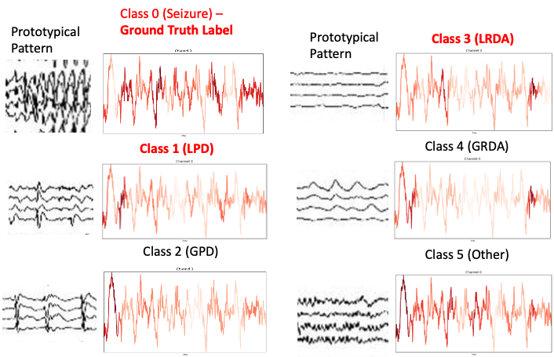

# Conformal Interpretability for EEG Signals

This project attempts to combine two different ideas into one framework for EEG seizure detection. In particular, it attempts to combine [Chefer's gradient attention feature attribution method](https://github.com/hila-chefer/Transformer-MM-Explainability) with [conformal prediction](https://arxiv.org/abs/2107.07511). The idea can be shown in the image below.

In particular, we have that the red text symbolizes classes within a prediction set and the red highlights the attention visualization on the original EEG signal.

The original idea was to leverage conformal prediction to best identify and narrow down which class of brain activity was most likely with some theoretical guarantees to contain the ground truth class, and then utilize the attention mechanism to narrow down the local raw signal that just so happened to be associated with each prediction in the prediction set.

However, there are currently some main limitations that I'll quickly summarize here that really killed this project's further development. 

- Lack of human annotated data on EEG signals. It's difficult to validate whether the model has truly learned invariant representations of EEG seizures. Not to mention, even experts have a hard time identifying whether a signal is a seizure, LRDA, or whatever other class.
- Distribution Shifts. None of the SoTA transformer models are robust against these distribution shifts and it is quite challenging to get them to generalize. Such problems violate CP's coverage guarantees and thus make it hard to trust any prediction sets.
- Attention, and specifically only considering tokens are ill-suited to a full comprehensive explanation. Superposition exists throughout many different token embeddings and thus such highlights may not truly be interpretable.
